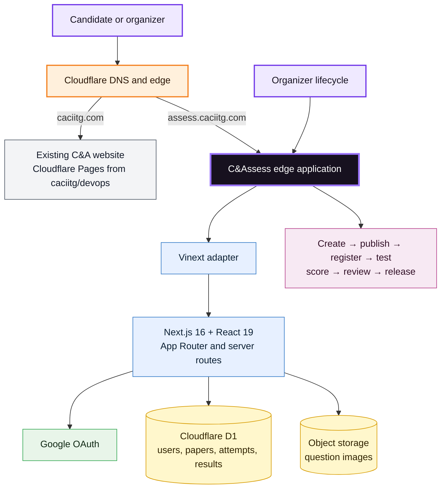

<div align="center">
  

  <br />

  <a href="https://assess.caciitg.com"><strong>Live platform</strong></a>
  ·
  <a href="https://assess.caciitg.com/attempt/demo">Exam demo</a>
  ·
  <a href="https://assess.caciitg.com/results/demo">Analysis demo</a>
  ·
  <a href="docs/PRODUCT_GUIDE.md">Product guide</a>

  <br /><br />

  [](https://github.com/caciitg/c-and-assess/actions/workflows/ci.yml)
  [](https://github.com/caciitg/c-and-assess/actions/workflows/codeql.yml)
  [](LICENSE)
  [](https://caciitg.com)
</div>

## Official repository and portfolio fork

The official, club-owned source is [caciitg/c-and-assess](https://github.com/caciitg/c-and-assess). [Hermes-25/c-and-assess](https://github.com/Hermes-25/c-and-assess) is Abhishek Das’s personal portfolio and contribution fork—not the deployment source. Original authorship and commit history are preserved.

See [Ownership and handover](docs/OWNERSHIP.md) for how to contribute, deploy and pass the project to future club teams.

## The short version

**C&Assess is a full-stack online assessment and post-test analysis platform built for real club operations.** Organizers can create an assessment, publish a question paper from CSV plus an image ZIP, manage registrations, run the test, review the cohort and release results—without editing backend code.

Candidates get a focused timed interface, recovery-friendly autosave, transparent integrity rules and a useful report covering score, rank, percentile, time use, topic gaps, solutions and next steps.

It was built under a demanding constraint: deliver the core experience of costly assessment products while keeping mandatory infrastructure cost near zero for controlled club pilots.

> Built by **[Abhishek Das](https://www.linkedin.com/in/abhishek-das-iitg/)** for the **[Consulting & Analytics Club, IIT Guwahati](https://caciitg.com)**. Maintained with the C&A Team.

## Why this project matters

Most student assessment workflows break into forms, spreadsheets, manual scoring and scattered result messages. C&Assess connects the whole lifecycle:

| Before the test | During the test | After the test |
| --- | --- | --- |
| Create and schedule assessments | Timed, distraction-light runner | Automatic objective scoring |
| CSV question publishing | Question palette and review flags | Rank and percentile |
| Exact image-file validation | Batched autosave and recovery | Topic and difficulty analysis |
| Registration controls | Clear tab-switch policy | Question-wise solutions |
| Organizer preview | Final-submit confirmation | Private error tracking and next steps |

The important product decision is that scoring and core analytics are **deterministic and auditable**. An exam does not become unavailable because an LLM provider is slow, expensive or returning inconsistent output.

## Product tour

| Candidate desk | Focused assessment |
| --- | --- |
|  |  |

<p align="center"><strong>Post-test analysis: the score is only the start.</strong></p>


All screenshots use the public demo experience. No candidate database record is shown.

## System architecture



The current public release uses an OpenAI Sites-managed Cloudflare runtime, D1 binding and object-storage binding. The locked target is a club-owned Worker deployed from this repository by GitHub Actions, backed by club D1 and optional private R2. R2 billing is deferred: the club staging configuration supports text-only papers until storage is approved. The live cutover remains gated by secrets, data migration, backup, monitoring and final-infrastructure rehearsal. See [Free-tier operation](docs/FREE_TIER.md), [Architecture](docs/ARCHITECTURE.md), [Deployment](docs/SETUP_AND_DEPLOYMENT.md) and the [cutover runbook](docs/DEPLOYMENT_CUTOVER.md).

## What I engineered

- **End-to-end product:** candidate, organizer, assessment, submission and results journeys in one application.
- **Database lifecycle:** versioned SQL migrations and a schema covering users, assessment rules, question versions, registrations, attempts, audit events, result jobs and analytics.
- **Spreadsheet-first operations:** safe replacement of a published paper only after every CSV row and referenced image validates.
- **Reliable exam state:** answers update immediately in the browser and checkpoint in batches instead of writing on every click.
- **Explainable scoring:** MCQ, multi-select and typed-answer evaluation with negative marking, tolerance and accepted variants.
- **Cohort analytics:** batched result jobs, ranks, percentiles, question metrics and topic/difficulty summaries.
- **Security boundaries:** server-side organizer allowlist, signed sessions, same-origin checks for mutations, security headers and rate-limit backstops.
- **Operations:** deployment gates, rollback guidance, exam-day freeze, load-test scripts and a controlled production rehearsal.

## Tech stack

| Layer | Choice | Why it fits |
| --- | --- | --- |
| UI | Next.js 16, React 19, TypeScript, CSS | One typed codebase for candidate and organizer experiences |
| Edge adapter | Vinext + Vite | Runs the App Router model on Cloudflare infrastructure |
| Compute | Cloudflare Workers-compatible runtime | Low-latency server routes close to candidates |
| Data | Cloudflare D1 + Drizzle ORM | SQL, migrations and simple operational ownership |
| Media | Object storage / R2-compatible `FILES` binding | Keeps image binaries out of database rows |
| Identity | Google OAuth 2.0 | Familiar sign-in without another password database |
| Import | Papa Parse + JSZip | Spreadsheet-friendly paper publishing with image bundles |
| Quality | ESLint, TypeScript, schema/scoring tests, GitHub Actions | Repeatable checks on every change |

## AI: where it helped—and where it does not sit

This was an **AI-assisted product engineering project**, not a thin wrapper around an API.

- AI was used as a design and engineering collaborator for product decomposition, interface critique, implementation support, test planning and documentation.
- Every generated suggestion was reviewed against the source, exercised in the browser and checked with repeatable build/test commands.
- The production scoring path does **not** call an LLM. Marks, ranks and percentiles remain reproducible.
- Personal recommendations currently use transparent rules derived from accuracy, attempt rate, difficulty and time behaviour.
- A future optional LLM layer can explain those already-computed facts in more natural language, but it must never change marks or block result publication.

Read the full [AI-assisted development note](docs/AI_ASSISTED_DEVELOPMENT.md), including safeguards against hallucinated logic and hidden evaluation changes.

## Evidence, not theatre

The release was checked through a fresh live organizer-to-result rehearsal on the final domain:

`create → CSV/image validation → publish → register → attempt → submit → batch analytics → release → analysis`

The controlled rehearsal verified objective scoring, persistence, rank/percentile, five analysis views, written solutions, audit history and image delivery across organizer preview, exam and released review.

The repository also includes an offline/locally emulated **4,000-candidate × 60-question capacity rehearsal**. Its 24,010-request run completed with zero request failures and a 5.32 s local-emulator p95. This validates logic and a realistic request pattern; it is explicitly **not** presented as final-domain production proof. A real public event still needs staged tests on the final club-owned infrastructure.

## Run it locally

### Prerequisites

- Node.js 22.13 or newer
- npm
- Python 3 for the portable schema replay test
- A Google OAuth web client for real sign-in

### Start

```bash
git clone https://github.com/caciitg/c-and-assess.git
cd c-and-assess
npm ci
cp .env.example .env.local
npm run dev
```

Open `http://localhost:3000`. Add the local Google callback URL shown in the [setup guide](docs/SETUP_AND_DEPLOYMENT.md) before testing sign-in.

### Check a change

```bash
npm run check
npm audit --omit=dev
```

For the database, OAuth, migrations, storage binding and deployment steps, follow [Setup and deployment](docs/SETUP_AND_DEPLOYMENT.md).

## Documentation map

| If you want to… | Read |
| --- | --- |
| Understand the components and request flow | [Architecture](docs/ARCHITECTURE.md) |
| Use the candidate or organizer product | [Product guide](docs/PRODUCT_GUIDE.md) |
| Prepare CSV files and map images correctly | [CSV import guide](docs/CSV_IMPORT_GUIDE.md) |
| Run locally or deploy a new instance | [Setup and deployment](docs/SETUP_AND_DEPLOYMENT.md) |
| Move production to the club Cloudflare account | [Club Cloudflare cutover](docs/DEPLOYMENT_CUTOVER.md) |
| Operate an assessment safely | [Operations runbook](docs/OPERATIONS_RUNBOOK.md) |
| See every known limitation and its reason | [Limitations and roadmap](docs/LIMITATIONS_AND_ROADMAP.md) |
| Understand the role of AI in the build | [AI-assisted development](docs/AI_ASSISTED_DEVELOPMENT.md) |
| Propose a change | [Contributing](CONTRIBUTING.md) |
| Report a vulnerability privately | [Security policy](SECURITY.md) |

## Honest scope

C&Assess is ready for controlled pilots and further club development. It is not yet a substitute for a proctored hiring vendor: webcam/screen surveillance, secure coding sandboxes, plagiarism detection, file submissions and high-stakes identity verification are intentionally outside the current release. Each limitation and the reason behind it is documented in [Limitations and roadmap](docs/LIMITATIONS_AND_ROADMAP.md).

## Ownership and licence

The application code is available under the [MIT Licence](LICENSE). The C&A name, logo and brand artwork remain the property of the Consulting & Analytics Club, IIT Guwahati and are not granted for unrelated use by the software licence; see [NOTICE](NOTICE.md).

Built by **Abhishek Das** for the **Consulting & Analytics Club, IIT Guwahati**.

[LinkedIn](https://www.linkedin.com/in/abhishek-das-iitg/) · [Portfolio](https://das-abhishek.vercel.app/) · [Email](mailto:work.abhishekdas@gmail.com)
